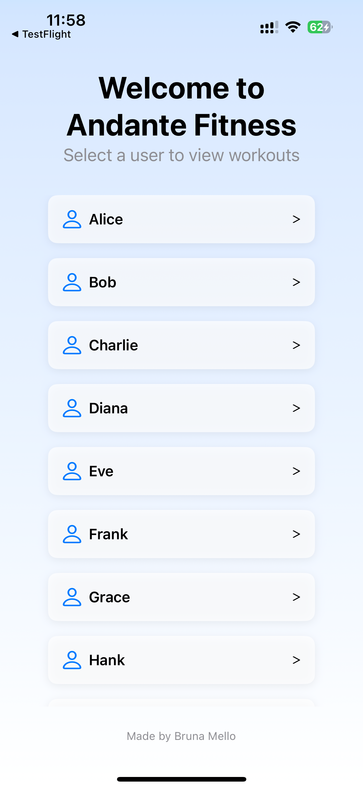
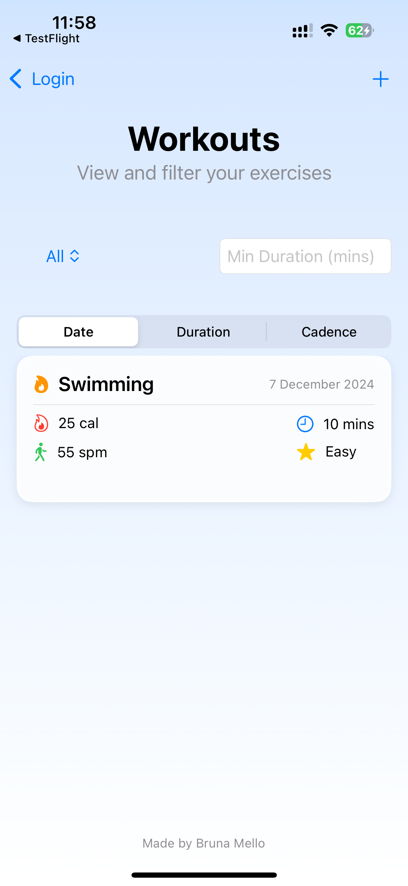
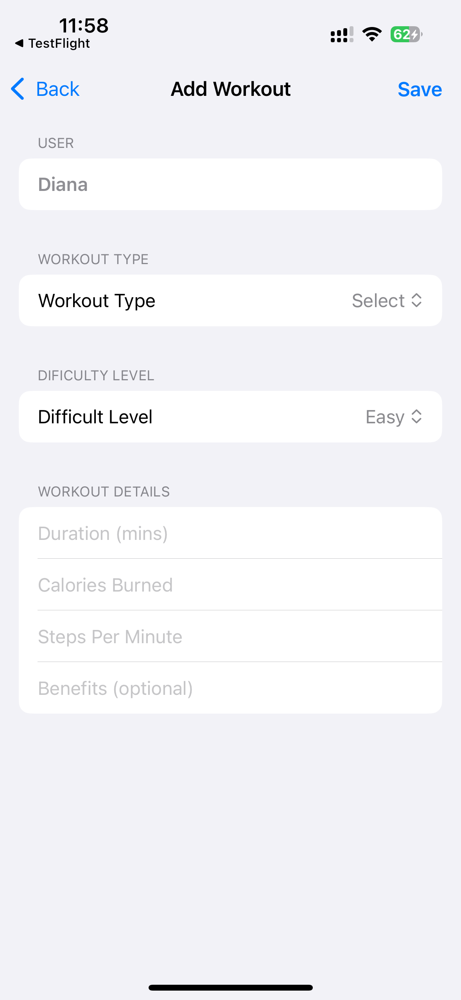

# Andante Fitness App

Andante Fitness is a fitness tracking application designed to provide users with a personalized and engaging way to monitor their workouts. 
The app includes features such as tracking workout details, filtering and sorting workouts, and adding custom workouts.

## Features
- **User Management**: View and select users to manage their workout data.
- **Workout tracking**: Monitor workout duration, calories burned, steps per minute, difficulty, and benefits.
- **Customization**: Add new workouts with detailed attributes like date, type, and difficulty.
- **Filtering and sorting**: Filter workouts by type, duration, or user and sort them by date, duration, or cadence.

## How to Run the Project

### TestFlight Deployment:
- The app is distributed using Apple’s TestFlight. Ensure you have TestFlight installed on your device.
- Receive the invitation link to join the beta testing group.
- Follow the link and install the app on your iOS device.

### Development Environment:
- Install the latest version of Xcode.
- Clone the project repository.
- Open the project in Xcode and run it on an iOS simulator or physical device.

### Getting Started with Development
1. Clone the repository:

`git clone https://github.com/your-repo/andante-fitness.git`

2. Open the project in Xcode:

- open Andante-Fitness.xcodeproj

3. Run the app on a simulator or device:
- Select your target device.
- Click the “Run” button in Xcode.

## Architectural and Technological Decisions

### Architecture
- **MVVM Pattern**: The app follows the Model-View-ViewModel architecture to maintain clean separation of concerns. This approach makes the app modular and testable.
- **Combine Framework**: Used for managing asynchronous API calls and binding data between views and view models.

### Technologies
- **SwiftUI**: A modern declarative UI framework for building responsive and dynamic user interfaces.
- **Combine**: Handles data flow and updates reactively.
- **JSON Parsing**: API data is fetched and decoded into Swift models using Decodable.
- **Persistence**: Local data is stored using UserDefaults for workouts created offline.

## Mocked Data Explanation

The data for stepsPerMinute and date is mocked because the API used does not provide these attributes by default. Random values are generated for:
- **Steps Per Minute**: A random value between 1 and 150.
- **Date**: A random date within the past 30 days.

This approach ensures consistent and meaningful data for development and testing purposes.

## Potential Improvements and Future Features
1. Enhanced API Support:
- Collaborate with the backend team to include stepsPerMinute and date in API responses.
- Add endpoints for workout creation and user management.
2. Real-Time Sync:
- Implement a cloud database (e.g., Firebase or Core Data with CloudKit) for syncing workout data across devices.
3. User Authentication:
- Add a secure authentication system with options for social logins.
4. Workout Analytics:
- Include charts and graphs to visualize workout trends over time.
- Introduce insights and recommendations based on user performance.
5. Dark Mode:
- Implement a theme toggle to support dark mode.
6. Localization:
- Translate the app into multiple languages to cater to a global audience.

### Screenshots

### Credits
**Developer**: Bruna Bianca Crespo Mello

For any questions or feedback, feel free to reach out. Happy fitness tracking! 🚀
